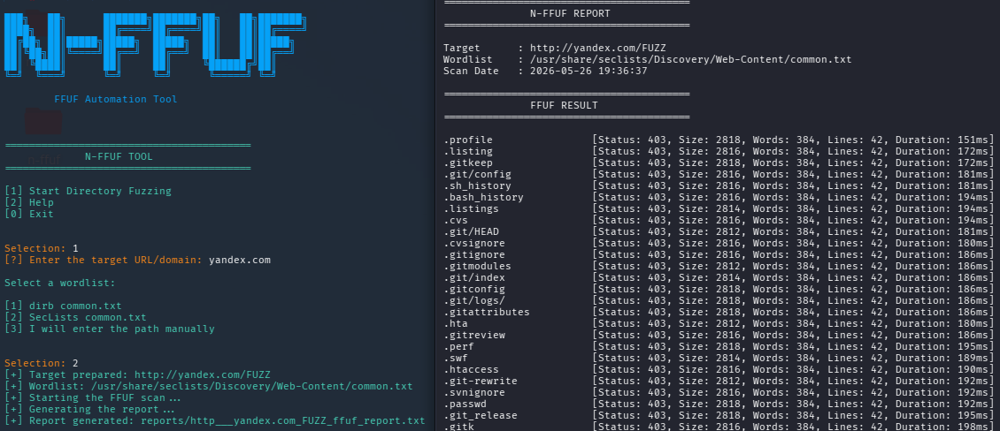

<div align="center">

# N-FFUF

```text
███╗   ██╗      ███████╗███████╗██╗   ██╗███████╗
████╗  ██║      ██╔════╝██╔════╝██║   ██║██╔════╝
██╔██╗ ██║█████╗█████╗  █████╗  ██║   ██║█████╗
██║╚██╗██║╚════╝██╔══╝  ██╔══╝  ██║   ██║██╔══╝
██║ ╚████║      ██║     ██║     ╚██████╔╝██║
╚═╝  ╚═══╝      ╚═╝     ╚═╝      ╚═════╝ ╚═╝
```

### FFUF Automation & Reporting Tool

Simple web fuzzing automation tool written in Python.

</div>

---

# Screenshot



---

# Features

- FFUF Automation
- Automatic FUZZ Injection
- Interactive Terminal Menu
- Custom Wordlist Selection
- Status Code Filtering
- Clean Result Parsing
- TXT Report Generation
- Colored CLI Interface
- Linux CLI Support

---

# Installation

## Clone Repository

```bash
git clone https://github.com/noyanastr/n-ffuf.git
cd n-ffuf
```

---

# Install Requirements

```bash
sudo apt update
sudo apt install ffuf dirb seclists
```

---

# Usage

## Run Tool

```bash
python3 n-ffuf.py
```

or:

```bash
n-ffuf
```

---

# Scan Flow

```text
Target Input
     ↓
URL Preparation
     ↓
FUZZ Injection
     ↓
FFUF Scan
     ↓
Result Filtering
     ↓
TXT Report Generation
```

---

# Example Output

```text
admin          [Status: 403]
dashboard      [Status: 200]
login          [Status: 301]
backup         [Status: 200]
```

---

# Report Output

Reports are automatically saved inside:

```text
reports/
```

Example:

```text
reports/example_com_ffuf_report.txt
```

---

# Technologies Used

- Python3
- FFUF
- Linux
- Subprocess Automation
- CLI Tooling

---

# Project Structure

```text
n-ffuf/
│
├── n-ffuf
├── README.md
├── n-ffuf-sc.png
│
└── reports/
```

---

# How It Works

1. User enters a target URL/domain
2. Tool prepares the target automatically
3. FUZZ keyword is injected
4. FFUF scan starts
5. Results are filtered
6. Clean report is generated

---

# Disclaimer

This tool is intended for educational purposes and authorized security testing only.

Unauthorized scanning of systems is illegal.

---

<div align="center">

### Developed by noyanastr

</div>
